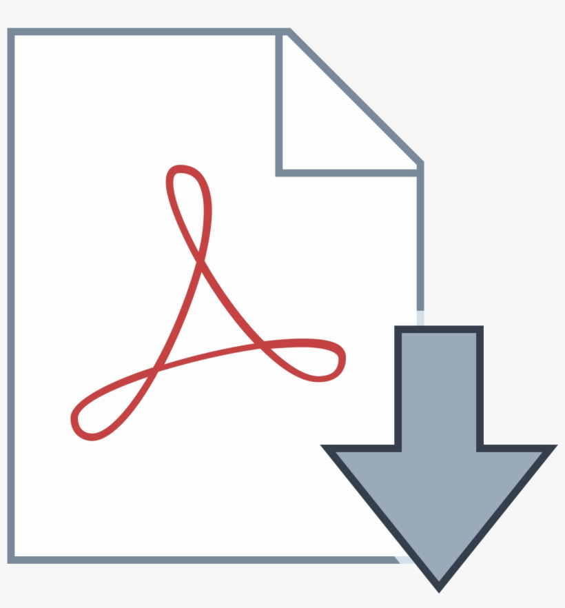

# FEATURES WE OFFER

### **Search by Programme**

Students and Staff can search for their schedule by programme, making it easy to find their classes and plan their time effectively.

### **Drag-and-Drop Interactions**

The solution offers drag-and-drop functionality, making it easy for the administrator to move and adjust classes as needed.

<figure><figcaption>
Drag and Drop
</figcaption></figure>

### **Conflict Detection**

iRatiba can detect scheduling conflicts and alert users, making it easy to avoid double-booking or overlapping classes.

### **Real-Time Updates**

Any changes made to the schedule are automatically updated in real-time, ensuring that everyone has access to the latest information.

### **User-Friendly Interface**

iRatiba has a simple and intuitive user interface that makes it easy to create and manage schedules.

### **Export PDF**

Staff and Students can export PDF versions of the schedule by programme or by course, making it easy to distribute and share schedules in a convenient format.

<figure><figcaption>
pdf
</figcaption></figure>

### **Timetable Conflict Resolution**

iRatiba can automatically resolve timetable conflicts by suggesting alternative times or classrooms, saving administrators time and effort.

### **Notifications on changes**

iRatiba can send notifications to students, faculty, and staff when there are changes to the schedule.
